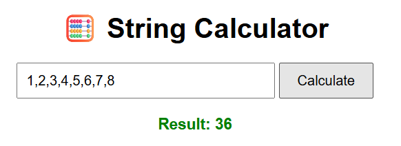
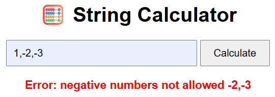
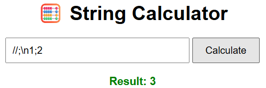

# string-calculator-tdd

This project implements a String Calculator using **Test-Driven Development** in JavaScript.  
It’s designed to show clean, incremental development with meaningful commits and working tests at every step.

## Problem Statement:

Write a method `add(string numbers)` that returns the sum of numbers in the string.  
It should support:

- Empty string returns 0  
- Single or multiple comma-separated numbers  
- Newline `\n` as valid delimiter  
- Custom delimiter in format `//;\n1;2`  
- Negative numbers throw an error  
- Numbers >1000 are ignored (additional)

## TDD Breakdown:

Each feature was implemented **one test at a time**, committing after:

- Failing test
- Minimal code to pass
- Refactor

## Final GUI Demo:
 
🔗 [Live demo](https://string-calculator-incubyte31.netlify.app/) 

## How to Run Locally:
npm install
npm test

Or open `index.html` and test it in the browser.

## Screenshots:

## Built With:

- JavaScript
- HTML/CSS
- Jest (for tests)
- TDD approach

